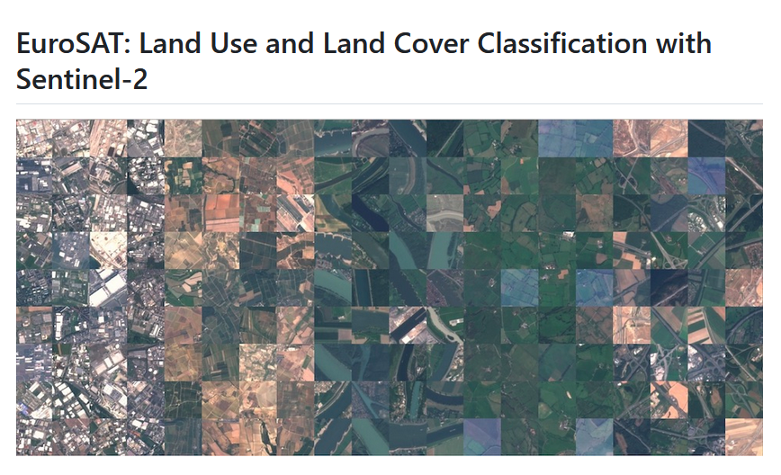

# Forslag til prosjekter

Velg ett eller flere av de foreslåtte prosjektene under, eller utforsk noe du kommer på selv.

Ta noen notater og screenshots underveis, for å kunne holde en rask presentasjon på fredag ettermiddag.

Hva gjorde dere, hva fant dere ut, hva var vanskelig?

## 1) Klassifisering av landekke: Multispektrale bilder



I notebooken [KlassifiseringEuroSAT.ipynb](../notebooks/2024/KlassifiseringEuroSAT.ipynb) gjorde vi klassisering av landekke med RGB bilder fra Sentinel 2.

Datasettet EuroSAT finnes også i mutispektral versjon.

Disse kan lastes ned med alle bånd via EuroSAT klassen fra `torchgeo`. Dette er ganske likt som da det ble hentet fra `torchvision` med et par forandringer.

Trenings og test sett defineres slik

```
from torchgeo.datasets import EuroSAT

train = EuroSAT(root="data",split="train",download=True)
test = EuroSAT(root="data",split="test",download=True)
```
Og for å hente data fra en batch

```
images,labels = batch["image"], batch["label"]
```

Ta utgangspunkt i notebooken for RGB bilder, gjør de nødvendige endringene for å tilpasse nettverkene til de multispektrale bildene og tren en eller flere modeller. Test ytelsen og lag en forvekslingsmatrise.

- Blir ytelsen bedre?
- Trengs det et større nettverk for å analysere bildene med når det er flere bånd og mer informasjon?
- I hvilke klasser ser man størst forskjell i hvodan RGB og MS presterer?

**Hint:** Det første laget i nettverkene for rgb bilder er laget for å ta inn 3 kanaler. Dette må endres for å ta inn 13 kanaler i stedet. (På samme måte som vi endret fra 1000 til 10 klasser i siste lag)

