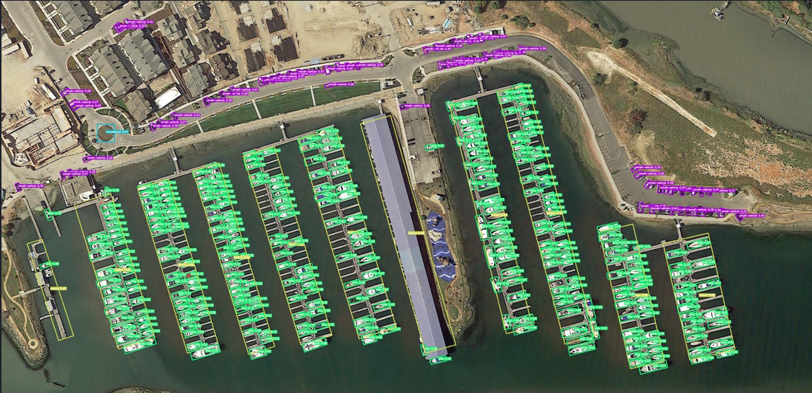
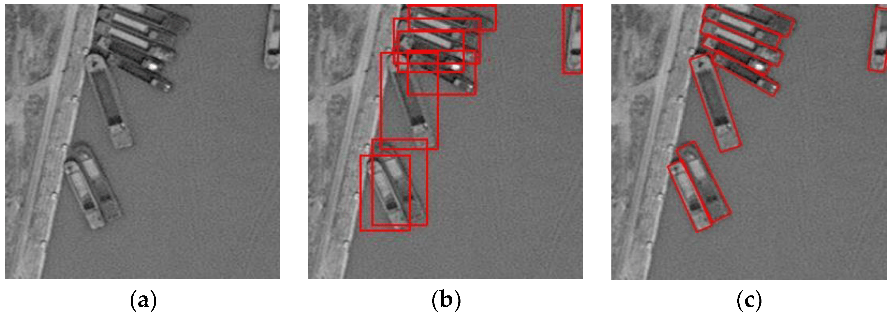

# Forslag til prosjekter

Velg ett eller flere av de foreslåtte prosjektene under, eller utforsk noe du kommer på selv.

Ta noen notater og screenshots underveis, for å kunne holde en rask presentasjon på fredag ettermiddag.

Hva gjorde dere, hva fant dere ut, hva var vanskelig?

## 1) Klassifisering av landekke: Multispektrale bilder


I notebooken [KlassifiseringEuroSAT.ipynb](../notebooks/2024/KlassifiseringEuroSAT.ipynb) gjorde vi klassisering av landekke med RGB bilder fra Sentinel 2.

Datasettet EuroSAT finnes også i mutispektral versjon.

Disse kan lastes ned med alle bånd via EuroSAT klassen fra `torchgeo`. Dette er ganske likt som da det ble hentet fra `torchvision` med et par forandringer.

Trenings og test sett defineres slik

```
from torchgeo.datasets import EuroSAT

train = EuroSAT(root="data",split="train",download=True)
test = EuroSAT(root="data",split="test",download=True)
```
Og for å hente data fra en batch

```
images,labels = batch["image"], batch["label"]
```

Ta utgangspunkt i notebooken for RGB bilder, gjør de nødvendige endringene for å tilpasse nettverkene til de multispektrale bildene og tren en eller flere modeller. Test ytelsen og lag en forvekslingsmatrise.

- Blir ytelsen bedre?
- Trengs det et større nettverk for å analysere bildene med når det er flere bånd og mer informasjon?
- I hvilke klasser ser man størst forskjell i hvodan RGB og MS presterer?

**Hint:** Det første laget i nettverkene for rgb bilder er laget for å ta inn 3 kanaler. Dette må endres for å ta inn 13 kanaler i stedet. (På samme måte som vi endret fra 1000 til 10 klasser i siste lag)

## 2) Objektdeteksjon fra Satellitt med YOLOv8-OBB



Når vi ser ting ovenfra er det ofte en fordel å ha roterbare bounding bokser.




YOLOv8 har en modell for dette vi ikke har tatt i bruk ennå - `YOLO-OBB`.

Det finnes ferdigtrente modeller som er trent på datasettet[DOTA V1](https://captain-whu.github.io/DOTA/index.html) som bruker bilder fra Google Earth og to kinensiske satellitter og har 15 innebygde klasser:

plane, ship, storage tank, baseball diamond, tennis court, basketball court, ground track field, harbor, bridge, large vehicle, small vehicle, helicopter, roundabout, soccer ball field and swimming pool

### Del 1: test den ferdigtrente modellen

YOLOv8-OBB kan lastes inn og kjøres på samme måte som vi brukte de andre yolo modellene, man må bare bytte ut modellen med

```
model = YOLO('yolov8n-obb.pt') # velg n,s,m,l etc
```

Test modellen på noen bilder du finner tatt ovenfra. Satellittbilder, drone etc. 


- Hvordan presterer modellen på forskjellig oppløsning, avstand etc?

- Hvordan er forskjellen på sivile og militære objekter?

### (Optional) Del 2: Tren modellen på DOTA v2

Den pretrente modellen er trent på DOTA v1.

DOTA har en ny versjon av datasettet, V2 som har nye annotasjoner og to nye klasser "Airport" og "Helipad".

Prøv å trene en YOLO modell på V2.

- Last ned DOTA v1 og de nye bildene og annotasjonene fra v2.

- Konverter annotasjonene til YOLO format med den innebygde `convert_dota_to_yolo_obb('path/to/DOTA')` som beskrevet her
https://docs.ultralytics.com/datasets/obb/#convert-label-formats

- Tren en modell på DOTAv2 med den innebygde `train` funksjonen som beskrevet her: https://docs.ultralytics.com/tasks/obb/#train


## 3) Endringsdeteksjon i SAR

Utforsk endringsdeteksjonskoden i SARpy på noen nye steder.

-  Finn 2 Sentinel 1 som er før og etter en hendelse.

**Hint** Se etter bilder som har samme bane (1-175) og er tatt i samme vinkel (Ascending/Descending).

- Kjør gjennom notebooken, hvilke endringer finner du, kan de verifiseres som ekte/falsker?

## 4) Kjør YOLO objektdeteksjon på video


Med OpenCV kan man enkelt lese inn video data frame for frame.

Koden under laster inn enn video, og kjører en valgt YOLO-modell på den.

Du kan velge om den skal vises frem in real time `show_video=True/False` og om en video med deteksjoner på skal lages `save_video=True/False`. Du må oppgi en fil der videoen skal lages.

Kjør koden på ulike typer video. Test ulike objekter, ulik avstand, ulik oppløsning og innsynsvinkel.

- Når fungerer den bra/dårlig?
- Hvor stabile er deteksjonene faller de inn/ut, bytter de klasse?

**Hint** En større modell vil prestere bedre, men bruke lenger tid per frame.

KODE: [deteksjon_video.py](notebooks/2024/deteksjon_video.py) (For live fremvisning må koden kjøres som et skript, og ikke fra notebook)

